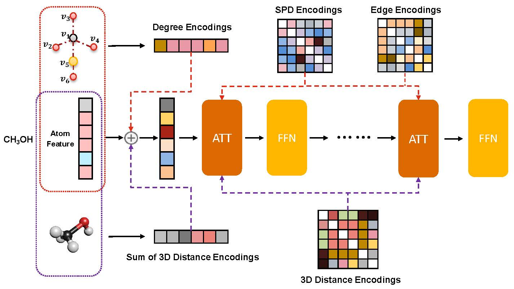

# One Transformer Can Understand Both 2D & 3D Molecular Data

This repository is the official implementation of “One Transformer Can Understand Both 2D & 3D Molecular Data”, based on the official implementation of [Graphormer](https://github.com/microsoft/Graphormer) and [Fairseq](https://github.com/facebookresearch/fairseq) in [PyTorch](https://github.com/pytorch/pytorch).

## Overview



Transformer-M is a versatile and effective molecular model that can take molecular data of 2D or 3D formats as input and generate meaningful semantic representations. Using the standard Transformer as the backbone architecture, Transformer-M develops two separated channels to encode 2D and 3D structural information and incorporate them with the atom features in the network modules. When the input data is in a particular format, the corresponding channel will be activated, and the other will be disabled. Empirical results show that our Transformer-M can achieve strong performance on 2D and 3D tasks simultaneously, which is the first step toward general-purpose molecular models in chemistry.

## Results on PCQM4Mv2, OGB-Large Scale Challenge


🚀**Note:**  **PCQM4Mv2** is also the benchmark dataset of the graph-level track in the **2nd OGB-LSC** at [**NeurIPS 2022 competition track**](https://ogb.stanford.edu/neurips2022/). As non-participants, we open source all the codes and model weights, and sincerely welcome participants to use our model. Looking forward to your feedback!

## Installation

- Clone this repository

```shell
git clone https://github.com/lsj2408/Transformer-M.git
```

- Install the dependencies (Using anaconda, tested with CUDA version 11.0)

```shell
cd ./Transformer-M
conda env create -f requirement.yaml
conda activate Transformer-M
pip install torch==1.7.1+cu110 torchvision==0.8.2+cu110 torchaudio==0.7.2 -f https://download.pytorch.org/whl/torch_stable.html
pip install torch_geometric==1.6.3
pip install torch_scatter==2.0.7
pip install torch_sparse==0.6.9
pip install azureml-defaults
pip install rdkit-pypi cython
python setup.py build_ext --inplace
python setup_cython.py build_ext --inplace
pip install -e .
pip install --upgrade protobuf==3.20.1
pip install --upgrade tensorboard==2.9.1
pip install --upgrade tensorboardX==2.5.1
```

## Checkpoints

| Model | File Size | Update Date  | Valid MAE on PCQM4Mv2 | Download Link                                            |
| ----- | --------- | ------------ | --------------------- | -------------------------------------------------------- |
| L12   | 189MB     | Oct 04, 2022 | 0.0785                | https://1drv.ms/u/s!AgZyC7AzHtDBdWUZttg6N2TsOxw?e=sUOhox |
| L18   | 270MB     | Oct 04, 2022 | 0.0772                | https://1drv.ms/u/s!AgZyC7AzHtDBdrY59-_mP38jsCg?e=URoyUK |

```shell
# create paths to checkpoints for evaluation

# download the above model weights (L12.pt, L18.pt) to ./
cd Transformer-M
mkdir -p logs/L12
mkdir -p logs/L18
mv L12.pt logs/L12/
mv L18.pt logs/L18/
```

## Datasets

- Preprocessed data: [download link](https://1drv.ms/u/s!AgZyC7AzHtDBeIDqE61u1ZEMv_8?e=3g428e)

  ```shell
  # create paths to datasets for evaluation/training
  
  # download the above compressed datasets (pcqm4mv2-pos.zip) to ./
  unzip pcqm4mv2-pos.zip -d ./datasets
  mv ./datasets ./Transformer-M
  ```

- You can also directly execute the evaluation/training code to process data from scratch.

## Evaluation

```shell
export data_path='./datasets/pcq-pos' 				   # path to data
export save_path='./logs/{folder_to_checkpoints}'	   # path to checkpoints, e.g., ./logs/L12

export layers=12									   # set layers=18 for 18-layer model
export hidden_size=768								   # dimension of hidden layers
export ffn_size=768									   # dimension of feed-forward layers
export num_head=32									   # number of attention heads
export num_3d_bias_kernel=128						   # number of Gaussian Basis kernels
export batch_size=256								   # batch size for a single gpu
export dataset_name="PCQM4M-LSC-V2-3D"				   
export add_3d="true"
bash evaluate.sh
```

## Training

```shell
# L12. Valid MAE: 0.0785
export data_path='./datasets/pcq-pos' # path to data
export save_path='./logs/'	          # path to logs

export lr=2e-4				          # peak learning rate
export warmup_steps=150000            # warmup steps
export total_steps=1500000            # total steps
export layers=12                      # set layers=18 for 18-layer model
export hidden_size=768                # dimension of hidden layers
export ffn_size=768			          # dimension of feed-forward layers
export num_head=32			          # number of attention heads
export batch_size=32		          # batch size for a single gpu
export dropout=0.0
export act_dropout=0.1
export attn_dropout=0.1
export weight_decay=0.0
export droppath_prob=0.1       # probability of stochastic depth
export noise_scale=0.2         # noise scale
export mode_prob="0.2,0.2,0.6" # mode distribution for {2D+3D, 2D, 3D}
export dataset_name="PCQM4M-LSC-V2-3D"
export add_3d="true"
export num_3d_bias_kernel=128  # number of Gaussian Basis kernels
bash train.sh
```

Our model is trained on 4 NVIDIA Tesla A100 GPUs (40GB). The time cost for an epoch is around 10 minutes.

## References

TBA

## Contact

Shengjie Luo (luosj@stu.pku.edu.cn)

Sincerely appreciate your suggestions on our work!

## License

This project is licensed under the terms of the MIT license. See [LICENSE](https://github.com/lsj2408/Transformer-M/blob/main/LICENSE) for additional details.
